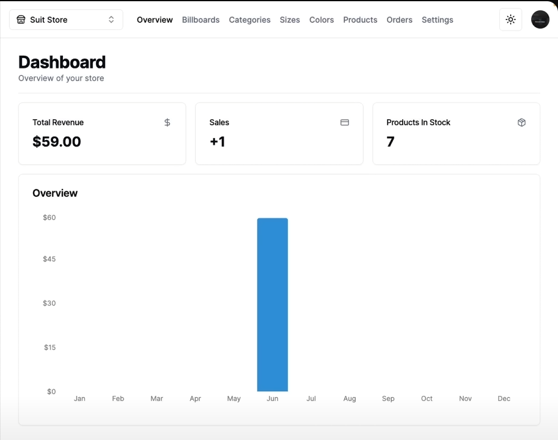

# E-commerce Full Stack Web App

---

A backend E-commerce CMS admin that can connect to multiple frontend E-commerce stores and manage their content.
 

Feature: 
- Create, update, and delete stores, categories, products
- Customize each store's style and contents individually 
- Track orders, profit, and inventory of each store with a graph 
- Create user accounts, login authentication, and checkout using various payment methods 
- Light/Dark UI Switch

Built with: 
- Next.js, TypeScipt, TailwindCSS, MySQL, Prisma, Shadcn UI
- Stripe API, Clerk Authentication API, Planet Scale API, Cloundinary API
